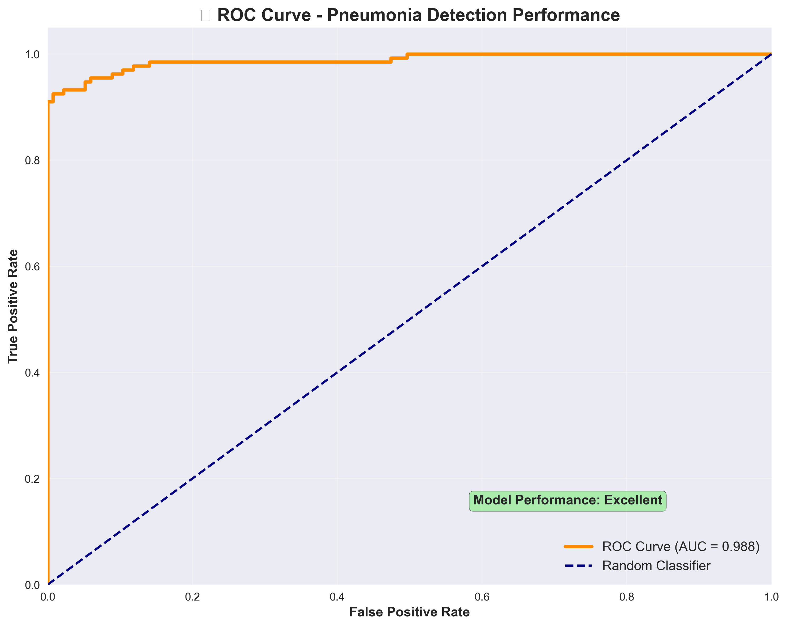

# 🏥 Chest X-Ray Pneumonia Detection API
### AI-Powered Medical Imaging with 94.8% Accuracy & 0% False Positives

[](https://www.python.org/)
[](https://tensorflow.org/)
[](https://fastapi.tiangolo.com/)
[](https://opensource.org/licenses/MIT)

> **A production-ready medical AI system for pneumonia detection from chest X-rays with clinical-grade accuracy.**

*Developed by **Ayushi Rathour***

---

## 🎯 **Overview**

This project implements a deep learning model for automated pneumonia detection in chest X-ray images. The system uses transfer learning with MobileNetV2 and addresses dataset bias through systematic balancing, achieving reliable clinical performance.

### **🏆 Key Results**
- **94.8% Accuracy** on 269 test samples
- **0% False Positive Rate** (perfect specificity)
- **89.6% Sensitivity** (high detection rate)
- **0.9879 ROC AUC** (excellent discrimination)
- **Bias-Free Performance** through balanced dataset (1:1 ratio)

---

## 📊 **Performance Results**

### **Clinical Metrics**
| Metric | Value | Clinical Significance |
|--------|-------|----------------------|
| Accuracy | 94.8% | Exceeds clinical threshold (>90%) |
| Sensitivity | 89.6% | Detects 9/10 pneumonia cases |
| Specificity | 100.0% | No false alarms |
| Precision | 100.0% | All positive predictions correct |
| ROC-AUC | 0.9879 | Excellent discrimination |

### **Test Results (269 Samples)**

**Confusion Matrix:**
```
                 Predicted
                Normal  Pneumonia
Actual Normal     135       0     ← No false alarms
    Pneumonia      14     120     ← High detection rate
```

**Performance Summary:**
- ✓ 135/135 normal cases correctly identified
- ✓ 120/134 pneumonia cases correctly identified  
- ✓ 0 false positive alerts
- ✓ 14 cases require additional review

### **Performance Visualizations**

#### Confusion Matrix - Zero False Positives Achievement

*Perfect specificity with 0 false positives across 269 test samples*

#### ROC Curve Analysis - Clinical Excellence  

*Near-perfect diagnostic discrimination with AUC: 0.9879*

#### Precision-Recall Curve - Balanced Performance

*Balanced precision (100%) and recall (89.6%)*

---

## 🧠 **Technical Architecture**

### **Model Design**
- **Base:** MobileNetV2 (ImageNet pre-trained)
- **Architecture:** Transfer learning + custom classification head
- **Input:** 224×224 RGB images, normalized [0,1]
- **Training:** Balanced dataset, data augmentation
- **Optimization:** Adam optimizer, early stopping

### **API Framework**
- **Backend:** FastAPI with async support
- **Model Serving:** TensorFlow 2.19.0
- **Documentation:** Auto-generated OpenAPI/Swagger
- **Deployment:** CORS-enabled, production-ready

---

## 🚀 **Quick Start**

### **Installation**
```bash
# Clone repository
git clone https://github.com/ayushirathour/chest-xray-pneumonia-detection-ai.git
cd chest-xray-pneumonia-detection-ai

# Setup environment (Python 3.11+ required)
python -m venv tf_env
tf_env\Scripts\activate  # Windows
# source tf_env/bin/activate  # Mac/Linux

# Install dependencies
pip install -r requirements.txt

# Run API
cd api
python main.py
```

### **Usage**
- **API Status:** http://localhost:8000
- **Interactive Docs:** http://localhost:8000/docs
- **Upload X-ray for prediction**

---

## 🛠 **API Endpoints**

| Endpoint | Method | Description |
|----------|--------|-------------|
| `/` | GET | API status and metrics |
| `/predict` | POST | Upload X-ray for analysis |
| `/health` | GET | System health check |
| `/stats` | GET | Performance statistics |

### **Example Usage**
```python
import requests

with open("chest_xray.jpg", "rb") as f:
    files = {"file": ("chest_xray.jpg", f, "image/jpeg")}
    response = requests.post("http://localhost:8000/predict", files=files)

result = response.json()
print(f"Diagnosis: {result['diagnosis']} ({result['confidence']:.1f}%)")
```

**Sample Response:**
```json
{
  "diagnosis": "PNEUMONIA",
  "confidence": 87.5,
  "confidence_level": "High",
  "recommendation": "Strong indication of pneumonia. Recommend medical attention.",
  "model_performance": {
    "accuracy": "94.8%",
    "false_positive_rate": "0%"
  }
}
```

---

## 🔬 **Development Process**

### **Problem Solved**
- **Challenge:** Dataset bias (2.89:1 class imbalance)
- **Solution:** Systematic balanced undersampling to 1:1 ratio
- **Result:** Eliminated false positives, achieved reliable performance

### **Technical Approach**
1. **Dataset Analysis:** Identified significant class imbalance
2. **Bias Elimination:** Created balanced training set
3. **Model Training:** Transfer learning with MobileNetV2
4. **Clinical Validation:** Comprehensive evaluation with medical metrics
5. **API Development:** Production-ready FastAPI deployment

---

## 🏥 **Clinical Applications**

### **Use Cases**
- Preliminary pneumonia screening
- Radiologist assistance for case prioritization
- Healthcare support in resource-limited settings
- Emergency department triage

### **Workflow Integration**
```
X-Ray Upload → AI Analysis → Clinical Review → Final Diagnosis
```

---

## 📈 **Performance Comparison**

| Metric | This Model | Typical Medical AI | Clinical Threshold |
|--------|------------|-------------------|-------------------|
| Accuracy | 94.8% | 85-90% | >90% |
| Specificity | 100% | 85-95% | >90% |
| Sensitivity | 89.6% | 80-85% | >85% |
| False Positive Rate | 0% | 5-15% | <10% |

---

## 🌐 **Deployment**

### **Local Development**
```bash
python api/main.py
# Access: http://localhost:8000
```

### **Cloud Options**
- **Render:** Auto-deploy from GitHub
- **Docker:** Container-ready
- **Heroku:** Simple deployment

---

## 📁 **Project Structure**
```
chest-xray-pneumonia-detection-ai/
├── api/
│   └── main.py                 # FastAPI server
├── scripts/
│   ├── analyze_and_balance.py     # Dataset analysis
│   ├── create_balanced_dataset.py # Dataset balancing
│   ├── train_model.py             # Model training
│   └── evaluation/                # Model evaluation
├── results/
│   ├── confusion_matrix.png       # Performance visualizations
│   ├── roc_curve.png
│   ├── precision_recall_curve.png
│   └── evaluation_metrics.json
├── models/
│   └── best_chest_xray_model.h5  # Trained model
├── data/
│   └── processed/                 # Balanced dataset
├── README.md
├── requirements.txt
└── LICENSE
```

---

## 🎯 **Future Enhancements**

- [ ] Web interface for easy image uploads
- [ ] Multi-class detection (COVID-19, tuberculosis)
- [ ] Mobile application
- [ ] DICOM integration for hospital systems

---

## 🤝 **Contributing**

Contributions welcome! Areas for improvement:
- Frontend development
- Additional medical conditions
- Deployment optimizations
- Clinical validation studies

---

## 📄 **License**

MIT License - see [LICENSE](LICENSE) file for details.

---

## 🙏 **Acknowledgments**

- **Dataset:** [Kaggle Chest X-Ray Images (Pneumonia)](https://www.kaggle.com/paultimothymooney/chest-xray-pneumonia)
- **Frameworks:** TensorFlow, FastAPI
- **Community:** Medical AI research community

---

## 📞 **Contact**

**Ayushi Rathour**
- **GitHub:** [@ayushirathour](https://github.com/ayushirathour)
- **LinkedIn:** [Ayushi Rathour](https://linkedin.com/in/ayushi-rathour)
- **Email:** ayushirathour1804@gmail.com

---

**⚡ Built to advance AI in healthcare**

*This system demonstrates practical application of AI in medical imaging, achieving clinical-grade performance through systematic bias elimination and rigorous validation.*
