```mermaid
graph TD
    A[224x224 X-ray Image] --> B(MobileNetV2 Backbone)
    B --> C[Global Average Pooling]
    C --> D[Dropout Layer 0.5]
    D --> E[Dense Layer 128 units]
    E --> F[Sigmoid Output]
    F --> G{Pneumonia Probability}
    G --> H[Normal < 0.5]
    G --> I[Pneumonia ≥ 0.5]
```

# 🥽 Chest X-Ray Pneumonia Detection - Externally Validated AI System

[](https://python.org)
[](https://tensorflow.org)
[](https://pneumodetectai.streamlit.app/)
[]()
[](https://huggingface.co/ayushirathour/chest-xray-pneumonia-detection)

### Deep Learning Model with Clinical-Grade Performance & Real-World Validation

**A professionally validated medical AI system for pneumonia detection with comprehensive external validation demonstrating real-world generalization.**

*Developed by **Ayushi Rathour***

---

## 📋 **Quick Navigation**
- [🌐 Live Demo](#-live-application)
- [🚀 API Demo](#-api-demo--fastapi-backend)
- [🎯 Project Overview](#-project-overview)
- [🤖 Pre-trained Model](#-pre-trained-model-access)
- [📊 Performance Results](#-performance-results---dual-validation-approach)
- [🚀 Quick Start](#-quick-start)
- [🧠 Technical Architecture](#-technical-architecture)
- [🗃️ Project Structure](#️-project-structure)
- [📊 Dataset Information](#-dataset-information)
- [⚠️ Limitations](#️-limitations--important-considerations)
- [🎯 Responsible AI](#-responsible-ai-disclaimer)
- [👥 Join the Development](#-join-the-development)
- [📞 Contact](#-contact--collaboration)

---

## 🌐 **Live Application**


*Complete workflow: Upload → AI Analysis → Clinical Results in 2.5 seconds*

### **🎯 Interactive Web Interface**
**🔗 [Try PneumoDetect AI Live](https://pneumodetectai.streamlit.app/)**

Experience the complete AI-powered pneumonia detection system with:
- **Professional Medical Interface** - Clean, clinical-grade glassmorphic design
- **Real-time Analysis** - Upload chest X-rays and get instant results in 2.5 seconds
- **Clinical Metrics Display** - 86% accuracy, 96.4% sensitivity, 1K+ training images
- **Comprehensive Reporting** - Detailed technical analysis with confidence scores
- **Mobile Responsive** - Works seamlessly across all devices
- **Privacy Focused** - No data storage, secure local processing

> **⚡ TL;DR:** AI system detects pneumonia in chest X-rays with 86% accuracy on external validation (485 samples). Try the live demo above or download the pre-trained model from HuggingFace.

---

## 🚀 **API Demo & FastAPI Backend**


*RESTful API workflow: Send Request → Get JSON Response → Process Results*

**🔧 API Features:** FastAPI backend • RESTful endpoints • JSON responses • Batch processing • Auto-documentation at `/docs`

---

## 🎯 **Project Overview**

This project implements an end-to-end deep learning system for automated pneumonia detection in chest X-ray images. The system underwent rigorous **internal and external validation** to ensure real-world applicability, achieving strong performance across independent datasets.

### **🏆 Key Achievements**
- ✅ **Comprehensive External Validation** on 485 independent samples
- ✅ **Strong Generalization** with only 8.8% accuracy drop on external data
- ✅ **Clinical-Grade Sensitivity** of 96.4% for pneumonia detection
- ✅ **Complete ML Pipeline** from training to deployment
- ✅ **Production-Ready Web Application** with Streamlit frontend
- ✅ **Professional Model Hosting** on Hugging Face Hub
- ✅ **Live Deployment** accessible globally via web interface

### **🎯 Performance Summary**

External validation achieved **86% accuracy** and **96.4% sensitivity**, showing strong generalization with only an **8.8% drop** from internal performance.

---

## 🤖 **Pre-trained Model Access**

**The trained model is hosted externally due to file size limitations:**

**🔗 [ayushirathour/chest-xray-pneumonia-detection](https://huggingface.co/ayushirathour/chest-xray-pneumonia-detection)**

### **Model Download Options:**

```python
# Option 1: Download from Hugging Face Hub
from huggingface_hub import hf_hub_download
model_path = hf_hub_download(
    repo_id="ayushirathour/chest-xray-pneumonia-detection", 
    filename="best_chest_xray_model.h5"
)

# Option 2: Load and use the model
import tensorflow as tf
model = tf.keras.models.load_model(model_path)
```

---

## 📊 **Performance Results - Dual Validation Approach**

### **🔬 Validation Methodology**

This system underwent **two-tier validation** to ensure reliable real-world performance:

| Validation Type | Dataset Source | Sample Size | Purpose |
|----------------|---------------|-------------|---------|
| **Internal Validation** | [Chest X-Ray Pneumonia Dataset](https://www.kaggle.com/datasets/paultimothymooney/chest-xray-pneumonia) | 269 samples | Model development & tuning |
| **External Validation** | [Independent Pneumonia Dataset](https://www.kaggle.com/datasets/iamtanmayshukla/pneumonia-radiography-dataset) | 485 samples | Real-world generalization testing |

### **📈 Comprehensive Performance Metrics**

| Metric | Internal Validation | External Validation | Performance Drop | Clinical Significance |
|--------|-------------------|-------------------|------------------|----------------------|
| **Accuracy** | 94.8% | 86.0% | 8.8% ↓ | ✅ Good generalization |
| **Sensitivity** | 89.6% | 96.4% | 6.8% ↑ | ✅ Improved detection |
| **Specificity** | 100.0% | 74.8% | 25.2% ↓ | ⚠️ More false positives |
| **Precision** | 100.0% | 80.4% | 19.6% ↓ | ✅ Acceptable accuracy |
| **F1-Score** | 94.5% | 87.7% | 6.8% ↓ | ✅ Balanced performance |
| **ROC-AUC** | 98.8% | 96.4% | 2.4% ↓ | ✅ Excellent discrimination |

### **🥽 Clinical Interpretation**
- **High External Sensitivity:** Excellent for pneumonia screening - catches 96% of cases
- **Moderate External Specificity:** Acceptable false positive rate for screening applications
- **Strong Generalization:** Only 8.8% accuracy drop indicates robust model performance
- **Clinical Applicability:** Performance suitable for preliminary screening and triage

---

## 🎨 **Comprehensive Validation Results**


*External ROC-AUC: 0.964 - Outstanding diagnostic discrimination capability*

<details>
<summary>📊 View All Validation Plots</summary>


*Perfect specificity (0% false positives) on 269 test samples*


*ROC-AUC: 0.9879 - Outstanding diagnostic discrimination*


*Excellent precision-recall balance for medical screening*


*177 TN, 59 FP, 9 FN with percentage annotations*


*Optimized for medical screening with high recall*


*Internal vs External validation showing good generalization*


*Balanced external validation set: 234 Normal vs 251 Pneumonia cases*


*Model confidence distribution across predictions*


*Model calibration analysis for reliable probability estimates*


*All key performance metrics in a single visualization*

</details>

---

## 🚀 **Quick Start**

### **🌐 Option 1: Use Live Web Application (Recommended)**

**🔗 [Try PneumoDetect AI Now](https://pneumodetectai.streamlit.app/)**
- No installation required
- Upload chest X-rays instantly  
- Get professional AI analysis in 2.5 seconds
- View external validation metrics
- Mobile-friendly responsive design

### **💻 Option 2: Run Locally**

```bash
# Clone repository
git clone https://github.com/ayushirathour/chest-xray-pneumonia-detection
cd chest-xray-pneumonia-detection

# Setup environment
python -m venv tf_env
tf_env\Scripts\activate # Windows
source tf_env/bin/activate # Linux/Mac

# Install dependencies
cd api
pip install -r requirements.txt

# Run Streamlit app
streamlit run streamlit_api_folder/streamlit_app.py
```

### **🤖 Option 3: Use Pre-trained Model in Code**

```python
from huggingface_hub import hf_hub_download
import tensorflow as tf
import numpy as np
from PIL import Image

# Download model from Hugging Face Hub
model_path = hf_hub_download(
    repo_id="ayushirathour/chest-xray-pneumonia-detection", 
    filename="best_chest_xray_model.h5"
)
model = tf.keras.models.load_model(model_path)

# Preprocess image
def preprocess_image(image_path):
    img = Image.open(image_path)
    img = img.resize((224, 224))
    img_array = np.array(img) / 255.0
    img_array = np.expand_dims(img_array, axis=0)
    return img_array

# Make prediction
image_path = "your_xray_image.jpg"
processed_img = preprocess_image(image_path)
prediction = model.predict(processed_img)
result = "Pneumonia" if prediction[0][0] > 0.5 else "Normal"
confidence = prediction[0][0] if prediction[0][0] > 0.5 else 1 - prediction[0][0]

print(f"Prediction: {result} (Confidence: {confidence:.2%})")
```

<details>
<summary>🔬 Train Your Own Model (Click to expand)</summary>

```bash
# Prepare your dataset (download links provided in scripts)
python scripts/analyze_and_balance.py
python scripts/create_balanced_dataset.py

# Train the model
python scripts/train_model.py

# Evaluate performance
python scripts/evaluate_model.py
python scripts/external_validation.py
```

</details>

---

## 🧠 **Technical Architecture**

### **🤖 Architecture Decision Rationale**
- **MobileNetV2 Selection:** Optimized for deployment efficiency over maximum accuracy
- **Trade-off Analysis:** 3% lower accuracy than ResNet50, but 5x faster inference
- **Resource Optimization:** 14MB model size enables low-resource deployment
- **Transfer Learning:** ImageNet pre-training for efficient medical adaptation

### **🗃️ Model Architecture**



### **🗃️ System Components**
- **Model:** Transfer learning with MobileNetV2 backbone (224×224 input)
- **Frontend:** Streamlit with glassmorphic medical design
- **Backend:** FastAPI with async request handling
- **Deployment:** Multi-platform (Streamlit Cloud, Docker support)
- **Validation:** Dual approach (internal + external datasets)

### **Web Application System**
- **Frontend:** Streamlit with glassmorphic design
- **Model Serving:** TensorFlow 2.19.0
- **Deployment:** Streamlit Cloud hosting
- **Response Format:** Real-time predictions with confidence scores
- **UI/UX:** Professional medical interface with animations

---

## 🗃️ **Project Structure**

```
chest-xray-pneumonia-detection/
├── 📂 api/
│   ├── 📄 main.py → FastAPI endpoints
│   ├── 📄 streamlit_app.py → Web interface
│   └── 🤖 best_chest_xray_model.h5 → Pretrained model
├── 📊 results/external_validation/ → Validation charts
├── 🎬 demo/pneumodetect_demo.gif → App demonstration
└── 📖 README.md → Project documentation
```

### **📁 Key Files Description**

| File | Purpose | Size/Type |
|------|---------|-----------|
| `api/main.py` | FastAPI backend server with prediction endpoints | Python |
| `api/streamlit_api_folder/streamlit_app.py` | Complete Streamlit web application | Python |
| `api/streamlit_api_folder/best_chest_xray_model.h5` | Pre-trained TensorFlow model | 10.8MB |
| `api/requirements.txt` | API-specific Python dependencies | Text |
| `demo/pneumodetect_demo.gif` | Streamlit app workflow demo | GIF |

---

## 📊 **Dataset Information**

### **Data Access**

**Datasets are NOT included in this repository.** Download instructions:

#### **Training Data**
- **Source:** [Chest X-Ray Images (Pneumonia)](https://www.kaggle.com/datasets/paultimothymooney/chest-xray-pneumonia)
- **Manual Download Required:** ~1GB dataset
- **Preprocessing:** Use `scripts/analyze_and_balance.py` to prepare
- **Final Training Set:** 1K+ balanced images

#### **External Validation Data**
- **Source:** [Pneumonia Radiography Dataset](https://www.kaggle.com/datasets/iamtanmayshukla/pneumonia-radiography-dataset)
- **Size:** 485 samples (234 Normal, 251 Pneumonia)
- **Access:** Download separately and place in `external_validation_dataset/`

### **Preprocessing Steps**
1. Download datasets from provided links
2. Run `python scripts/analyze_and_balance.py`
3. Run `python scripts/create_balanced_dataset.py`
4. Processed data will be created locally (not committed to repo)

---

## ⚠️ **Limitations & Important Considerations**

### **🔬 Technical Limitations**
- **Training Data Size:** Limited to balanced subset of Kaggle dataset (1K+ images)
- **Image Quality Dependency:** Performance degrades with poor quality images
- **Binary Classification Only:** Cannot detect specific pneumonia types
- **Resolution Constraints:** Input images resized to 224×224 may lose detail

### **🥽 Clinical Limitations**
- **Screening Tool Only:** NOT suitable for definitive diagnosis
- **Professional Oversight Required:** All results must be reviewed by radiologists
- **Clinical Context Missing:** Cannot consider patient history or symptoms
- **Legal Liability:** Not approved by medical regulatory bodies

### **📊 Performance Limitations**
- **False Positive Rate:** 25.2% means 1 in 4 normal cases flagged incorrectly
- **Dataset Bias:** Limited testing across populations and imaging protocols
- **Temporal Stability:** No longitudinal validation over time

---

## 🎯 **Responsible AI Disclaimer**

### **⚠️ Important Notices**
- **Experimental System:** This is a research prototype, not a medical device
- **No Clinical Approval:** Not validated by FDA, CE, or other regulatory bodies
- **Educational Purpose:** Designed for learning and AI validation methodology
- **Professional Supervision:** Clinical use requires qualified radiologist oversight

### **Recommended Use Cases**
- ✅ **Academic Research:** Demonstrating external validation methodology
- ✅ **Educational Training:** Teaching AI in healthcare concepts
- ✅ **Technical Portfolio:** Showcasing end-to-end ML pipeline
- ❌ **Clinical Diagnosis:** Not suitable for patient care decisions
- ❌ **Regulatory Submission:** Not ready for medical device approval

---

## 👥 **Join the Development**

**Seeking Collaborators:**
- 🩺 **Medical Professionals** - Clinical validation and feedback
- 🎨 **UI/UX Designers** - Enhanced medical interface design  
- 💻 **Python Developers** - API features and optimization
- 📊 **Data Scientists** - Model improvement and validation

**How to Contribute:**
- 🍴 Fork the repository
- 🔧 Submit pull requests
- 🐛 Report issues and bugs
- 📧 Contact for research collaboration

*[Get Involved](mailto:ayushirathour1804@gmail.com) | [Contributing Guidelines](CONTRIBUTING.md)*

---

## 🌟 **Next Steps**

**Ready to explore PneumoDetect AI? Choose your path:**

- **🚀 [Try Live Demo](https://pneumodetectai.streamlit.app/)** *(2.5 sec analysis)*
- **📥 [Download Model](https://huggingface.co/ayushirathour/chest-xray-pneumonia-detection)** *(for local use)*
- **🤝 [Contribute](CONTRIBUTING.md)** *(as medical/technical collaborator)*
- **⭐ [Star Repository](https://github.com/ayushirathour/chest-xray-pneumonia-detection)** *(support the project)*

---

## 📄 **Citation & License**

```bibtex
@misc{rathour2025pneumonia,
    title={Chest X-Ray Pneumonia Detection: Externally Validated AI System with Live Web Interface},
    author={Rathour, Ayushi},
    year={2025},
    note={External validation on 485 independent samples, Live demo at https://pneumodetectai.streamlit.app/},
    url={https://github.com/ayushirathour/chest-xray-pneumonia-detection}
}
```

**License:** MIT - See LICENSE for details

---

## 🏆 **Acknowledgments**
- **Training Dataset:** [Paul Timothy Mooney - Chest X-Ray Images (Pneumonia)](https://www.kaggle.com/datasets/paultimothymooney/chest-xray-pneumonia)
- **External Validation Dataset:** [Tanmay Shukla - Pneumonia Radiography Dataset](https://www.kaggle.com/datasets/iamtanmayshukla/pneumonia-radiography-dataset)
- **Frameworks:** TensorFlow, scikit-learn, Streamlit
- **Model Hosting:** Hugging Face Hub
- **Web Hosting:** Streamlit Cloud

---

## 📞 **Contact & Collaboration**

**Ayushi Rathour** - *Biotechnology Graduate | AI in Healthcare Researcher*
- **🌐 Live Demo:** [PneumoDetect AI](https://pneumodetectai.streamlit.app/)
- **GitHub:** [@ayushirathour](https://github.com/ayushirathour)
- **LinkedIn:** [Ayushi Rathour](https://linkedin.com/in/ayushi-rathour)
- **Email:** ayushirathour1804@gmail.com
- **HuggingFace:** [ayushirathour](https://huggingface.co/ayushirathour)

---

**⚡ Advancing AI in Healthcare Through Rigorous Validation & Accessible Deployment**

*This project demonstrates the complete journey from AI research to production deployment, emphasizing the importance of external validation in medical AI while providing an accessible web interface for global use.*

---

**⭐ If you find this project helpful, please consider starring the repository and sharing it with others interested in AI in healthcare!**
