# 🥽 Chest X-Ray Pneumonia Detection - Externally Validated AI System

[](https://python.org)
[](https://tensorflow.org)
[](https://pneumodetectai.streamlit.app/)
[]()
[](https://huggingface.co/ayushirathour/chest-xray-pneumonia-detection)

### Deep Learning Model with Clinical-Grade Performance & Real-World Validation

*Developed by **Ayushi Rathour***

---

## 🎯 **Why It Matters**

Pneumonia affects millions globally, requiring rapid and accurate diagnosis from chest X-rays. This AI system addresses the critical need for reliable automated screening with **rigorous external validation** - something most medical AI projects lack.

### **🏆 Key Achievements:**
* **86% External Validation Accuracy** on 485 independent samples
* **96.4% Sensitivity** - Catches 96% of pneumonia cases  
* **Strong Generalization** - Only 8.8% accuracy drop on unseen data
* **Production Ready** - Live web interface + RESTful API

> **⚡ TL;DR:** AI detects pneumonia in chest X-rays with clinically validated performance. **[Try Live Demo](https://pneumodetectai.streamlit.app/)** | **[Download Model](https://huggingface.co/ayushirathour/chest-xray-pneumonia-detection)**

---

## 🌐 **Live Experience**


*Complete workflow: Upload → AI Analysis → Clinical Results in 2.5 seconds*

### **🚀 [Try PneumoDetect AI Live](https://pneumodetectai.streamlit.app/)**

**Professional Medical Interface Features:**
* **Instant Analysis** - Sub-second inference with confidence scores
* **DICOM Support** - Professional radiology format (.dcm files)
* **AI Attention Maps** - Visual explanation of model decisions
* **PDF Reports** - Clinical-grade reports with dual image layout
* **Zero Data Storage** - Completely secure local processing
* **Mobile Responsive** - Works seamlessly across all devices

---

## 📊 **Proof of Reliability**

### **🔬 Rigorous Dual Validation**

| Validation Type | Dataset | Sample Size | Purpose |
|----------------|---------|-------------|---------|
| **Internal** | [Training Dataset](https://www.kaggle.com/datasets/paultimothymooney/chest-xray-pneumonia) | 269 samples | Model development |
| **External** | [Independent Dataset](https://www.kaggle.com/datasets/iamtanmayshukla/pneumonia-radiography-dataset) | 485 samples | Real-world testing |

### **📈 Performance Metrics**

| Metric | Internal | External | Drop | Clinical Significance |
|--------|----------|----------|------|----------------------|
| **Accuracy** | 94.8% | **86.0%** | 8.8% ↓ | ✅ Good generalization |
| **Sensitivity** | 89.6% | **96.4%** | 6.8% ↑ | ✅ Excellent screening |
| **Specificity** | 100.0% | **74.8%** | 25.2% ↓ | ⚠️ Acceptable for screening |
| **ROC-AUC** | 98.8% | **96.4%** | 2.4% ↓ | ✅ Outstanding discrimination |

### **🏥 Clinical Interpretation**
The **96.4% sensitivity** means this system catches 96 out of 100 pneumonia cases - excellent for initial screening. The **25.2% false positive rate** is acceptable for a screening tool, as it's better to flag healthy cases for review than miss pneumonia cases.

<details>
<summary>📊 View Detailed Validation Results</summary>


*External ROC-AUC: 0.964 - Outstanding diagnostic discrimination*


*177 TN, 59 FP, 9 FN with percentage annotations*


*Internal vs External validation showing robust generalization*


*Model calibration analysis for reliable probability estimates*


*Complete performance overview in single visualization*

</details>

---

## 🎯 **Project Overview**

This end-to-end medical AI system demonstrates the complete journey from research to production deployment, with emphasis on **external validation** - a critical step often missing in academic projects.

### **🏗️ Complete ML Pipeline:**
* **Data Processing** - Balanced dataset creation and preprocessing
* **Model Training** - Transfer learning with MobileNetV2 backbone
* **Dual Validation** - Internal development + external generalization testing
* **Web Deployment** - Professional Streamlit interface
* **API Development** - RESTful FastAPI backend
* **Model Hosting** - Professional distribution via Hugging Face Hub

---

## 🚀 **Quick Start**

*Choose your preferred way to get started:*

### **🌐 Option 1: Live Web App (No Setup)**
**🔗 [Try PneumoDetect AI Now](https://pneumodetectai.streamlit.app/)**
* Upload X-rays instantly and get results in 2.5 seconds
* Perfect for testing, demos, and quick analysis

### **💻 Option 2: Run Locally (Streamlit)**
```bash
git clone https://github.com/ayushirathour/chest-xray-pneumonia-detection
cd chest-xray-pneumonia-detection/api
pip install -r requirements.txt
streamlit run streamlit_api_folder/streamlit_app.py
```

### **🔌 Option 3: API Server (FastAPI)**
```bash
# Same setup as above, then:
uvicorn main:app --host 0.0.0.0 --port 8000
# Access docs at: http://localhost:8000/docs
```

### **📥 Option 4: Use Pre-trained Model**
```python
from huggingface_hub import hf_hub_download
import tensorflow as tf

# Download and load model
model_path = hf_hub_download(
    repo_id="ayushirathour/chest-xray-pneumonia-detection", 
    filename="best_chest_xray_model.h5"
)
model = tf.keras.models.load_model(model_path)
```

<details>
<summary>🔬 Option 5: Train Your Own Model</summary>

```bash
# Download datasets (links in Dataset section below)
python scripts/analyze_and_balance.py
python scripts/create_balanced_dataset.py

# Train and evaluate
python scripts/train_model.py
python scripts/evaluate_model.py
python scripts/external_validation.py
```

</details>

---

## 🚀 **API for Developers**


*RESTful API workflow: Send Request → Get JSON Response → Process Results*

### **🔗 Key Endpoints:**
* `POST /predict` - Upload X-ray image for pneumonia detection
* `GET /health` - API health and model status
* `GET /stats` - External validation performance metrics
* `GET /docs` - Interactive Swagger documentation

### **📊 Sample Response:**
```json
{
  "diagnosis": "PNEUMONIA",
  "confidence": 92.4,
  "confidence_level": "High",
  "recommendation": "Strong indication of pneumonia. Seek immediate medical attention.",
  "external_validation_performance": {
    "accuracy": "86.0%",
    "sensitivity": "96.4%"
  }
}
```

### **🐍 Python Integration:**
```python
import requests

# Simple prediction
with open("chest_xray.jpg", "rb") as f:
    response = requests.post("http://localhost:8000/predict", files={"file": f})
    result = response.json()
    print(f"Diagnosis: {result['diagnosis']} ({result['confidence']}%)")
```

---

## 🧠 **Technical Architecture**

### **🤖 Model Design Rationale:**
* **MobileNetV2 Backbone** - Optimized for deployment efficiency over maximum accuracy
* **Trade-off Analysis** - 3% lower accuracy than ResNet50, but 5x faster inference
* **Resource Optimization** - 14MB model enables low-resource deployment
* **Transfer Learning** - ImageNet pre-training for efficient medical adaptation

### **🏗️ Architecture Diagram:**

```mermaid
graph TD
    A[224x224 X-ray Image] --> B(MobileNetV2 Backbone)
    B --> C[Global Average Pooling]
    C --> D[Dropout Layer 0.5]
    D --> E[Dense Layer 128 units]
    E --> F[Sigmoid Output]
    F --> G{Pneumonia Probability}
    G --> H[Normal < 0.5]
    G --> I[Pneumonia ≥ 0.5]
```


### **🗃️ System Components:**
* **Frontend:** Streamlit with glassmorphic medical design
* **Backend:** FastAPI with async request handling  
* **Model Serving:** TensorFlow 2.19.0 with optimized inference
* **Deployment:** Multi-platform (Streamlit Cloud, Docker ready)
* **Documentation:** Auto-generated OpenAPI specs

### **📁 Project Structure:**
```
chest-xray-pneumonia-detection/
├── api/                 # Streamlit frontend, FastAPI backend, model weights, dependencies
├── scripts/             # Model training, evaluation, dataset preprocessing  
├── results/             # Validation results and performance plots
├── demo/                # Application demo GIF
├── README.md            # Project documentation
├── requirements.txt     # Python dependencies
├── LICENSE              # License info
└── .gitignore           # Git ignore rules
```

---

## 📊 **Datasets & Preprocessing**

### **📁 Data Sources**
**Important:** Datasets are NOT included in repository. Manual download required:

* **Training Data:** [Chest X-Ray Images (Pneumonia)](https://www.kaggle.com/datasets/paultimothymooney/chest-xray-pneumonia) - ~1GB dataset
* **External Validation:** [Pneumonia Radiography Dataset](https://www.kaggle.com/datasets/iamtanmayshukla/pneumonia-radiography-dataset) - 485 samples

### **🔄 Preprocessing Pipeline:**
1. Download datasets from provided Kaggle links
2. Run `python scripts/analyze_and_balance.py` for data analysis
3. Execute `python scripts/create_balanced_dataset.py` for preprocessing
4. Balanced datasets created locally (1K+ training images)

---

## ⚠️ **Medical Disclaimers**

### **🚨 Critical Limitations**
* **Research Prototype** - NOT a medical device or FDA/CE approved
* **Screening Tool Only** - NOT for definitive diagnosis
* **Professional Review Required** - All results need radiologist oversight
* **25.2% False Positive Rate** - 1 in 4 normal cases may be flagged incorrectly

### **📊 Technical Constraints**
* **Binary Classification** - Cannot detect specific pneumonia types
* **Image Quality Dependent** - Performance degrades with poor quality scans
* **Dataset Limitations** - Limited population and imaging protocol diversity
* **No Clinical Context** - Cannot consider patient history or symptoms

### **✅ Appropriate Use Cases**
* Academic research and methodology demonstration
* Educational AI in healthcare training
* Technical portfolio projects
* **NOT for clinical diagnosis or patient care decisions**

---

## 🚀 **Get Involved & Contact**

### **🎯 Take Action:**
* **[🌐 Try Live Demo](https://pneumodetectai.streamlit.app/)** - Experience the system in 2.5 seconds
* **[📥 Download Model](https://huggingface.co/ayushirathour/chest-xray-pneumonia-detection)** - Integrate into your projects
* **[⭐ Star Repository](https://github.com/ayushirathour/chest-xray-pneumonia-detection)** - Support open medical AI
* **[📖 API Documentation](http://localhost:8000/docs)** - When running locally

### **👥 Collaboration Opportunities:**
* 🩺 **Medical Professionals** - Clinical validation and expert feedback
* 🎨 **UI/UX Designers** - Enhanced medical interface design
* 💻 **Python Developers** - API optimization and new features
* 📊 **Data Scientists** - Model improvement and validation expansion

### **📞 Contact:**
**Ayushi Rathour** - *Biotechnology Graduate | AI in Healthcare Researcher*
* **📧 Email:** [ayushirathour1804@gmail.com](mailto:ayushirathour1804@gmail.com)
* **💼 LinkedIn:** [Ayushi Rathour](https://linkedin.com/in/ayushi-rathour)
* **🐙 GitHub:** [@ayushirathour](https://github.com/ayushirathour)
* **🤗 HuggingFace:** [ayushirathour](https://huggingface.co/ayushirathour)

---

## 📄 **Citation & License**

```bibtex
@misc{rathour2025pneumonia,
    title={Chest X-Ray Pneumonia Detection: Externally Validated AI System},
    author={Rathour, Ayushi},
    year={2025},
    note={External validation on 485 independent samples},
    url={https://github.com/ayushirathour/chest-xray-pneumonia-detection}
}
```

**License:** MIT - See LICENSE for complete terms

---

## 🏆 **Acknowledgments**

* **Training Dataset:** [Paul Timothy Mooney - Chest X-Ray Images](https://www.kaggle.com/datasets/paultimothymooney/chest-xray-pneumonia)
* **External Validation:** [Tanmay Shukla - Pneumonia Radiography](https://www.kaggle.com/datasets/iamtanmayshukla/pneumonia-radiography-dataset)
* **Frameworks:** TensorFlow, scikit-learn, Streamlit, FastAPI
* **Hosting:** Hugging Face Hub, Streamlit Cloud

---

**⚡ Advancing AI in Healthcare Through Rigorous Validation & Accessible Deployment**

*Demonstrating that medical AI can be both scientifically robust and practically accessible to the global community.*